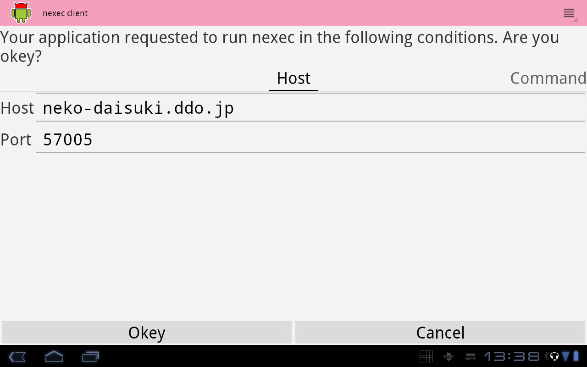
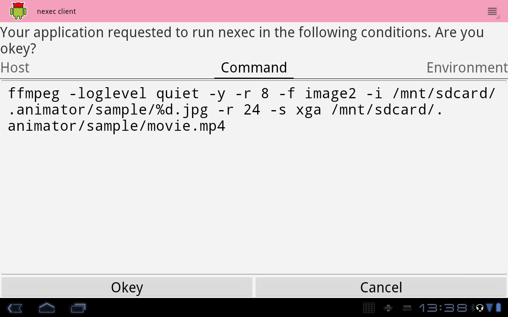

nexec client for Android
************************

.. image:: ic_launcher-web.png

.. contents:: Table of contents

Overview
========

nexec client for Android is the application of nexec_ client. This application
lets you using applications on FreeBSD from your Android tablet.

.. _nexec: http://neko-daisuki.ddo.jp/~SumiTomohiko/nexec/index.html

This application has the following two additional functions which have not been
included nexec_ (yet).

* Access control mechanism
* Redirection of file access

One is the access control mechanism. Android client denies to open unexpected
files.

The other is redirection of file access. If an application in a master machine
requested to open a file, Android client can open another file instead of the
requested one.

How to use
==========

This is not a launcher application
----------------------------------

This is not a launcher application. You can use this with other applications
such as `android-nexec-client-demo`_ or `animator`_.

.. _android-nexec-client-demo:
    http://neko-daisuki.ddo.jp/~SumiTomohiko/android-nexec-client-demo/index.html
.. _animator:
    http://neko-daisuki.ddo.jp/~SumiTomohiko/animator/index.html

If your application had requested to nexec, android-nexec-client shows the
following screen to show you what the application had requested. When you
dislike these settings, you must cancel. If you accept, of cource, push "Okey".
Your application will connect with the server to run the shown command.

Host page
---------

This page shows the nexec server information.

Command page
------------

You can see what command will be executed in this page.

Files page
----------

Files in this page are what the application requested to open/read/write.

.. image:: file_page.png

Redirection page
----------------

"Redirection" page shows sources/destination of redirection.

.. vim: tabstop=4 shiftwidth=4 expandtab softtabstop=4
